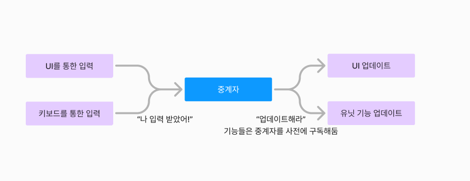

# 프로젝트 스팀팩
> 내일배움캠프 Unity 6기 최종 프로젝트<br>

## 🎬 시연 영상
[](https://youtu.be/krMvo7Z7BQI)

# 📗 목차
* 게임 소개
* 주요 기능
* 주요 사용 기술
* 유저 피드백
* 트러블슈팅
* 기타

# 📌 게임 소개
> `소녀전선2 : 망명` 모작 프로젝트</br>
`장르` : 3D 서브컬쳐 SRPG

> 이 프로젝트는 개인적인 공부와 프로그래밍 포트폴리오 목적으로 개발된 비상업적 게임 프로젝트입니다.</br>원작 게임 "소녀전선: 망명2"의 팬 제작물로, 원작의 권리를 존중하며 상업적 사용이나 수익 창출은 일절 없습니다.

### 게임 미리 보기
---


---

>### 턴제 전투 시스템
플레이어와 적의 턴이 번갈아가며 진행됩니다.</br>
오고가는 턴을 진행하며 상대의 전력을 모두 전멸시키세요!

>### 가챠 시스템
기본적으로 제공되는 유닛 외에도 다양한 매력과 기능을 가진 유닛을 뽑아보세요!

>### 직관적인 조작감
클릭만으로도 충분히 게임을 즐길 수 있습니다!

### 게임 기능 소개
---
<details>
  <summary><b>타이틀</b></summary>
  <div markdown="1">
    <ul>
    
    - 익명 게임 플레이를 할 수 있습니다.</br>
    - 회원가입 및 로그인을 할 수 있습니다.</br>
    - 로그인 후 플레이시 유저 데이터가 클라우드에 저장됩니다</br>
    </ul>
  </div>
</details>
<details>
  <summary><b>메인 로비</b></summary>
  <div markdown="1">
    <ul>
    
    - 메인 로비 화면입니다</br>
    - 각종 기능 UI를 확인할 수 있습니다.</br>
    - 유저 재화 수치를 확인할 수 있습니다</br>
    </ul>
  </div>
</details>
<details>
  <summary><b>튜토리얼</b></summary>
  <div markdown="1">
    <ul>
    
    - 게임을 처음  시작하면 튜토리얼로 진입합니다.</br>
    - 기본적인 유닛 컨트롤 방법 및 카메라 조작에 대해 배울 수  있습니다.</br>
    </ul>
  </div>
</details>
<details>
  <summary><b>스테이지 선택</b></summary>
  <div markdown="1">
    <ul>
    
    - 스테이지를 선택해 게임을 시작할 수 있어요</br>
    - 선택하면 선택한 스테이지의 정보를 팝업해 줍니다</br>
    - 스테이지 진입시 로딩 화면을 보여주며 게임이 시작됩니다.</br>
    </ul>
  </div>
</details>
<details>
  <summary><b>스테이지 진행</b></summary>
  <div markdown="1">
    <ul>
    
    - 유닛을 선택해 작전을 시작할 수 있습니다.</br>
    - 엄폐물과 유닛의 스킬로 전략적으로 적을 처치합니다</br>
    - 유닛 전멸, 턴 제한 등 패배 조건을 피해 목표를 달성해야 합니다</br>
    - 미션 성공시 유닛의 경험치 증가와 재화를 얻습니다</br>
    - 패배시 스테이지 재시도와 로비로 돌아갈 수 있습니다.</br>
    - 오토 및 배속 기능을 활용해 게임을 진행 할 수 있습니다.</br>
    </ul>
  </div>
</details>
<details>
  <summary><b>유닛 관리</b></summary>
  <div markdown="1">
    <ul>
    
    - 보유한 유닛의 목록을 확인 할 수 있습니다.</br>
    - 유닛 레벨업, 한계 돌파 등 능력치를 강화 할 수 있습니다.</br>
    - 유닛의 스킬을 선택해 스킬의 자세한 정보를 알 수 있습니다.</br>
    </ul>
  </div>
</details>
<details>
  <summary><b>모집</b></summary>
  <div markdown="1">
    <ul>
    
    - 비용이 비싼 모집일수록 더 좋은 확률의 유닛을 얻습니다</br>
    - 유닛을 모집 시 뽑은 유닛의 연출을 재생합니다</br>
    - 모집이 끝날 시 얻은 유닛의 목록과, 중복으로 얻은 유닛은 돌파에 필요한 재화를 얻습니다</br>
    </ul>
  </div>
</details>
<details>
  <summary><b>업적</b></summary>
  <div markdown="1">
    <ul>
    
    - 다양한 조건의 업적들을 가지고 있습니다.</br>
    - 한번에 클리어, 누적으로 클리어 되는 조건의 업적이 나뉩니다.</br>
    - 보상을 받을 시 보상 UI를 출력해줍니다.</br>
    </ul>
  </div>
</details>

---

## 🎮기본 조작 방법🎮
>### 주요 조작 방법 
* 마우스 클릭만으로도 모든 기능을 즐길 수 있으세요!
>###  인 게임 조작
* 마우스 클릭 : 유닛 선택 및 공격 대상 선택
* 숫자 1 ~ 4 : 선택한 유닛이 가진 스킬 선택
* ESC : 명령 번복
* Z : 명령 수행 및 행동 종료

</br>

# 📌 주요 사용 기술

## 🔨 Behavior Tree
>💡 **구현 이유**
- 새로운 움직임 유형이 생길때마다 새로운 FSM 제작을 회피하기 위해
- 효율적인 유닛의 행동 관리

>**📌 주요 구현 사항**

- `Behavior Tree`는 계층적 구조를 이용하여 유닛의 행동을 순차적으로 결정
- `Selector`, `Sequence`, `Leaf` 노드와 같은 기본 구성 요소를 활용하여 다양한 행동 정의 가능

## 🔨 Command Flow
>💡 **사용 이유**
- 명령을 캡슐화하여 행동 실행과 호출의 분리를 통해 유연성과 확장성 확보
- 중앙집중 명령 처리를 통해 명령의 명확한 흐름 관리

>**📌 주요 구현 사항**

- 명령 인터페이스 정의
- 구체적 명령 수행 클래스 작성
- 유저 인터랙션 시 명령 스레드에 삽입, 명령 순차적 비동기 실행

## 🔨 Unity Gaming Services
>**사용 이유**
- 유저 데이터 클라우드 저장
- 백엔드 작업 없이 클라우드 기반의 게임 시스템을 빠르게 구축.

>**📌 구현 방법**

- `UGSRequester` 클래스 구현
- 자식 클래스 `Authentication` 클래스로 로그인 서비스 구현

## 🔨 UI System
>💡 **사용 이유**
- UI 캐쉬로 리소스 관리 최적화
- 여러 종류의 UI에 대응하는 확장성
- 애니메이션 코드 없이 손쉽게 반응형 UI 제작
    
    

>📌**구현 방법**

- **`UIManager`**
    - UI의 생성, 관리, 제거를 담당하는 중심 역할
    - `Singleton`을 통한 UI의 중앙 집중식 관리를 구현
- **`UIBase`**
    - 유니티의 인터랙션 이벤트 바인딩 기능 제공
    - 추상화된 최상위 클래스로 관리

- **`UIPopUp & UIAnimation`**
    - **`UIBase`** 클래스를 상속받는 파생 컴포넌트
    - `UIBehaviorBase` 클래스와 연동해 열릴떄, 닫힐때, 마우스 진입시, 클릭시 등 다이나믹, 유저 반응형 UI 제작
    - 인스펙터로 코드 없이 여러 파생되는 다이나믹 UI 제작 가능

        
        
- **`UIBehavior`**
    - UI가 열릴 때, 닫힐 때, 상호작용 시 실행되는 애니메이션이나 이벤트 로직을 일관된 방식으로 관리.
        - 예: 페이드 인/아웃, 슬라이드 이동, 크기 변화 등.
    - 메서드 팩토리 패턴을 사용해 동작을 동적으로 생성해 구현

## 🔨 GoogleSheets & JSON
>💡 **사용 이유**

- 다양한 리소스를 유연하게 관리
- 데이터 기반 프로그래밍으로 손쉬운 컨텐츠 확장

>**📌 구현 방법**

- 구글 시트에서 데이터 작성 후, 파싱 프로그램을 통해 JSON으로 변환

    

## 🔨 CustomEditor
>💡 **사용 이유**

- 스테이지 셀 및 장애물을 배치 ,제거
- 그리드 기반 배치 시스템 (그리드를 시각적으로 렌더링)
- 복잡한 맵 제작을 수작업으로 좌표를 입력하는 대신 시각화하여 생산성을 높이기 위해 구현
- 실시간으로 결과를 확인하며 스테이지를 구성할 수 있게 됐습니다.
- 추후에 기획자나 레벨디자인을 할 때 쉽게 맵디자인을 할 수 있도록 제작

## 🔧 사용 기술
### ⚙️ 알고리즘

---

- *A** (A-Star): 경로 탐색 알고리즘
    - 셀 기반 최단 경로 탐색을 위해
    
        
    
- BFS **(**Breadth-First Search)
    - 넓이 우선 탐색으로 특정 셀 기준 퍼져나가는 방식의 탐색 진행
    - 스테이지의 셀을 인접한 주변 셀과 연결된 하나의 그래프로 적용하여
    넓이 우선 탐색하며 UI 레이아웃 위치를 조정

### ⚙️ 디자인 패턴

- **`커맨드 패턴`**
    - 명령을 캡슐화하여 실행, 취소, 저장 가능
    - MoveCommand, AttackCommand 등 명령을 캡슐화 하여 전달
- **`팩토리 & 빌더 패턴`**
    - UIAnimation 담당 객체 생성시 원하는 객체를 동적으로 팩토리 메서드 패턴을 통해 생성
    - 복합적인 사운드 데이터를 빌더 패턴을 통해 생성
- **`오브젝트 풀`**
    - 각종 이팩트 및 사운드를 오브젝트 풀링을 통해 생성과 파괴 오버헤드 감소
        
        
        
- **`옵저버 패턴 & 이벤트 버스`**
    - 유닛이 죽었을때 등 조건을 달성할 경우 이벤트 버스를 통한 전역적인 이벤트 발행
    - 각종 이벤트 구독으로 특정 상태 변경의 관찰
- **`상태머신`**
    - 턴 시스템을 시작, 턴 진행, 종료 상태 등을 턴의 수행을 각각의 상태로 캡슐화하여 구현
    - 플레이어 턴 구현 시 선택, 명령, 정지 상태로 나누어 상황에 맞게 상태를 바꿔가며 구현
- **`행동트리`**
    - AI의 행동을 행동트리 기반으로 구현
    - 루트노드로부터 뻗어나가 현 상태에서 최적의 판단을 실행
- **`싱글톤`**
    - 각각의 중요 오브젝트 또는 매니저 오브젝트에 적용하여 접근성을 높임
- **`빌더 패턴`**
    - 사운드 복합 데이터 생성 시 빌더 패턴 적용
- **`팩토리 패턴`**
    - UI 애니메이션 생성, 스테이지 보상 정보 생성에 팩토리 패턴 적용

### ⚙️ 데이터 관리

- **`구글 스프레드 시트 & JSON`**
    - 각종 데이터의 집합 관리, 유닛, 업적 데이터, 다이얼로그, 스킬 정보 등등
- **`유니티 게이밍 서비스 ( UGS )`**
    - 유저 게임 진행 데이터 클라우드 저장, 로드
- **`스크립트에이블 오브젝트 ( SO )`**
    - 스테이지 셀 위치 정보 저장 후 로드

### ⚙️ 기타

- **`코루틴`**
    - 유닛의 커맨드, UI 애니메이션 등 비동기적 처리에 전반적인 사용
- **`익스텐션`**
    - 확장 메서드를 통해 보다 편리하고 재사용성 높은 메서드 구현
- **`델리게이트`**
    - 이벤트 기반 설계
    - 하나의 로직으로 다양한 사용 구현
- **`제네릭`**
    - 제네릭을 이용한 범용적 UI 호출  및  여러 사용처
- **`Shader Graph & ParticleSystem`**
    - 게임 인디케이터, 파티클 등 자체적인 비주얼 효과를 구현하는데 사용

</BR>
</BR>

## 📫 유저 테스트
### [ 테스트 결과 ]

>기간: 2025.01.06 ~ 2025.01.10 (5일) </br>
참여 수: 총 26명  </br>
참여 방법: 프로그램 실행파일 다운로드  </br>
설문 방법: 구글 설문 조사 기능 이용  </br>

### [ 평가 점수 ]


> ### 피드백 개선 목록


## 📬 피드백 반영
<details>
  <summary><b>📬 주요 피드백 개선 </b></summary>
  <div markdown="1">
<aside>

### ❓ 자동 전투 및 배속 기능 건의

총 11건의 자동 전투 기능 추가 요청
부가적으로 배속 기능 또한 요청
>📌 문제 분석

SRPG의 특성상 반복 전투가 많아 피로도가 높음 </br>
장시간 플레이가 필요한 스테이지에서 피로도가 급격히 상승함 </br>
적 유닛이 많아질수록 유저가 구경하는 시간이 점점 길어져 흥미를 잃음 </br>

>✅ 자동 및 배속 기능 기대 효과

유저 피로도 감소 </br>
배속 기능을 통한 게임 템포 증가
>💡 구현

게임 상단 우측에 배속 및 자동 전투 UI 제공 </br>
튜토리얼 클리어 시 해당 기능 해금 </br>
명령 실행 중에는 안정성 및 애니메이션 싱크 문제를 고려하여 명령이 끝난 뒤 배속 적용 </br>

</br>

### ❓ 다이얼로그 및 튜토리얼 개선

게임의 조작법과 시스템이 직관적이지 않아 어렵게 느끼는 경우가 많음 </br>
스토리텔링이 부족하다는 의견 다수 접수
>📌 문제 분석

조작법과 시스템의 복잡성으로 인해 게임에 익숙해지기 어려움 </br>
스토리 전달 부족으로 게임의 세계관 몰입도 저하 </br>
>✅ 다이얼로그 시스템 개발과 튜토리얼 개발

직관적이고 친절한 튜토리얼을 통해 초기 게임 적응도가 향상됨 </br>
확장 가능한 다이얼로그 시스템으로 튜토리얼 외 스토리 전달에도 활용 가능 </br>
>💡 구현

튜토리얼을 한 번도 완수하지 않은 경우 게임 시작과 동시에 튜토리얼로 진입 </br>
다이얼로그 시스템을 활용해 게임 조작법 설명과 스토리 전달 </br>
몰입도를 높이기 위한 추가 스토리 다이얼로그 추가

</br>

### ❓ 유닛 강화 방식에 대한 의견

>🚨 피드백

스테이지 반복 클리어를 통해 유닛을 강화하는 시스템이 유저 피로도를 유발 </br>
유저는 추가 재화를 활용해 유닛을 강화하는 방식을 선호 </br>
>📌 문제 분석

반복적인 스테이지 클리어가 유닛 강화의 유일한 수단으로 작용해 흥미 반감 </br>
유저 선택권 부족으로 플레이 스타일의 다양성이 제한 </br>
유사 장르에서는 다양한 강화 옵션으로 유저 만족도를 높이는 추세 </br>
>✅ 기대 효과

스테이지 클리어 외에도 재화나 자원을 활용한 강화 방식 제공으로 선택권 확대 </br>
반복 작업 부담 감소로 유저 만족도 향상 </br>
>💡 구현

반복 전투로 얻는 경험치와 재화를 직접 강화에 사용하는 옵션 제공 </br>
스테이지 클리어 보상을 강화에 활용 가능하도록 설계 </br>
</aside>
  </div>
</details>

</br>
</br>

# 📌 트러블슈팅
<details>
  <summary><b>💡 1. 플레이어 인터랙션 구조</b></summary>
  <div markdown="1">

>## 문제 상황 및 원인 : PlayerInteraction의 과도한 책임

<aside>

>**🚨 문제 상황**

`PlayerInteraction`이 당시 다음과 같은 기능들을 담당했고 서로 다른 과도한 책임이 몰려 문제가 생겼습니다.
> 
- 행동
    - 플레이어 입력을 받아 유닛에게 명령 전달합니다.
    - 무슨 스킬을 선택했는지 명령을 전달합니다.
    - 명령 처리 과정에서 UI 및 인디케이터 호출을 담당합니다.
- 결과
    - **`PlayerInteraction`**과 유닛 명령 간의 결합도 증대
    - 스킬의 다양한 인터랙션으로 PlayerInteraction의 책임 지속 증가
    - 모든 스킬 로직이 포함으로 새로운 스킬을 추가 및 수정 어려움

>**📌 문제 분석**

- **`PlayerInteraction`** 클래스가 너무 많은 역할을 위임해 많은 기능을 수행 중

>**✅ 해결 방법**

- PlayerInteraction 역할 최소화   
    
- 플레이어 입력을 중계하고, 유닛에 명령 전달만 담당.
- 유닛의 CommandSystem 도입
- `입력` → `PlayerInteraction`→ `CommandSystem` → `Unit` 행동 순으로 구조 변경

    

>💡 **평가**

- `PlayerInteraction`의 책임이 줄어들어 유지보수가 쉬워졌습니다.
- 유닛과 명령 시스템 간 결합도가 낮아지고, 새로운 스킬 구현 시 `PlayerInteraction`을 수정할 필요가 없어졌습니다.
- 확장 가능한 구조를 통해 다양한 스킬 추가가 용이해졌습니다.
- 위와 같은 긍정적인  효과가 있는 반면 다음과 같은 영향도 생겼습니다
    - 구조적 복잡성이 증가했습니다.
    - 작업을 하기 위해선 구조에 대한 사전 학습이 필요해졌습니다.
</aside>
  </div>
</details>
<details>
  <summary><b>💡 2. 패시브 이벤트 구조</b></summary>
  <div markdown="1">

>## 문제 상황 및 원인 : 패시브 이벤트 구조

<aside>

>**🚨 문제 상황**

 패시브 스킬 관리가 당시 다음과 같은 기능들을 담당했고 서로 다른 과도한 책임이 몰려 문제가 생겼습니다.
 
- 행동
    - 패시브 스킬이 발동될 타이밍과 조건을 상위 모듈에서 처리.
    - 상위 모듈에서 각 패시브 스킬의 동작을 직접 제어하고, 새로운 스킬을 추가할 때마다 상위 모듈을 수정
    - 패시브 스킬의 트리거 조건을 변경하려면 상위 모듈에 수정 사항을 반영
- 결과
    - 패시브 스킬의 독립성이 부족하여 새로운 스킬 추가 및 관리가 어려움
    - 명령 이벤트가 상위 모듈에서 처리되어 패시브 스킬의 발동 타이밍을 정확히 제어할 수 없음
    - 모든 스킬 로직이 포함으로 새로운 스킬을 추가 및 수정 어려움

>**📌 문제 분석**

- `CommandController` 클래스가 너무 많은 역할을 위임해 많은 기능을 수행 중

>**✅ 해결 방법**

- 패시브 스킬 자율성 증가
    
    <aside>
    
    
    
    </aside>
    
    - 각 패시브 스킬은 `ExecuteCommandEvent`를 구독
    - 스킬이 독립적으로 자신의 조건을 확인하고 실행

>💡 **평가**

- 패시브 스킬이 독립적으로 동작하고, 새로운 스킬 추가가 용이해졌습니다.
- 상위 모듈을 수정할 필요 없이 각 패시브 스킬을 수정하면 되므로 코드 변경 범위가 줄어들었습니다.
</aside>
  </div>
</details>

<details>
  <summary><b>💡 3. UI 인터렉션 연동</b></summary>
  <div markdown="1">
<aside>

>## 문제 상황 및 원인 : UI 인터렉션 연동 문제

>**🚨 문제 상황**

2개 이상의 입력을 통해 유닛의 인터랙션을 구현하는 중 문제가 발생했습니다.

- 행동
    - 키보드를 통한 인풋을 유닛에게 전달
    - UI를 통한 인풋을 유닛에게 전달
- 결과
    - 키보드를 통해 입력시 UI 찾아가 선택 된 스킬을 켜주어야 함
    - 모든 입력 체계가 유닛 명령 구조와 강한 결합

>**📌 문제 분석**

- 입력의 종류가 많아질수록 결합도가 증가
- 새로운 입력이 추가 될 시 UI가 해당 입력에 연동 되어야 함

>**✅ 해결 방법**

- 선택하지 않은 방법 A
    - 키보드를 통한 입력 시, UI에도 접근해주어 UI의 업데이트도 진행하는 방법
        
        <aside>
        
        이렇게 진행할 경우 입력에 대한 추가 기능을 구현할 때 UI 입력, 키보드 입력 두 가지에 대해서 수정 작업을 해주어야 합니다.
        
        다시말해 추가적인 기능을 만들때, 해당 기능의 작업 뿐만 아니라 입력에 대응시키는 작업을 계속 추가해야 합니다.
        
        키보드 입력에서 UI를 업데이트를 위해 제어할 UI가 너무 많았습니다. 이걸 무리하게 진행한다면 키보드 입력 기능과 UI 기능 간의 결합도가 너무 강해질 것이 우려되었습니다.
        
        </aside>
        
- 프로젝트에 적용한 방법 B
    
    <aside>
    
    

    </aside>
    
    - 입력을 처리하는 부분과 기능을 실행 및 업데이트 하는 부분을 분리해서 처리
    - 나눠진 행위를 중계해줄 객체를 구현

>💡 **평가**

- 향후 입력으로 인한 새로운 기능 추가나 새로운 종류의 입력을 추가하더라도
중계자를 통해 호출해주기만 하면 원하는 결과를 얻을 수 있다는 장점이 있습니다
</aside>
  </div>
</details>

<details>
  <summary><b>💡 4. 유니티 시네머신 오류</b></summary>
  <div markdown="1">
<aside>

>## 문제 상황 및 원인 : 유니티 시네머신 오류

👿 유니티 시네머신 오류


>**🚨 문제 상황**

시네머신 카메라 `Follow / LookAt` 에 대하여 해당 오브젝트를 바라보지 않는 버그가 발생했습니다.

- **버그 발생 조건 추적**
    - 시네머신 카메라 `Follow / LookAt` 에 빈 오브젝트를 넣어주고, 해당하는 유닛의 `CameraPoint`를 동적으로 할당하면서 오류 발생.
    - `GameManager / CameraController` 하위에 모든 시네머신 카메라를 담고, 프리팹화 했을 때
    시네머신에 `Transposer / Composer` 로 해당 유닛의 `Body / Aim`을 조정하는 중 `LookAt`을 설정했는데도 불구하고, Aim이 해당 타겟을 보지 않는 오류발생.

>**📌 문제 분석**

1. **빈 오브젝트를 LookAt 할 때 두 가지 문제점이 발생 가능성**
    - 스케일 값이 `(0, 0, 0)`일때, 회전값이 제대로 작동하지 않을 수 있다.
    - 빈 오브젝트가 다른 오브젝트와 상호작용할때, 제대로 인식되지 않을 수 있다.
2. **프리팹 해둔 시네머신 카메라를 계속해서 수정하면서, `Body / Aim`이 원하지 않은 `DoNothing`의 상태가 되어 있는 경우 또는 같은 값을 여러 번 넣어야 인식하는 문제 발생**
    - 가설 1) 값이 잘못되었거나 읽어야 할 값을 제대로 읽어 오지 못한다.
    - 가설 2) 유니티 엔진의 버그로 시네머신 카메라가 담긴 프리팹에 문제가 생긴 것일 수 있다.

>**✅ 해결 방법**

- 빈 오브젝트를 넣지 않은 상태로, 스크립트에서 바로 `CameraPoint`를 할당하였습니다.
    
    <aside>
    
    ```csharp
    [SerializedField] Transform followTarget;//인스펙터할당 빈 오브젝트의 Transform
    
    Transform targetUnit = Unit.CameraPoint;//선언변수
    followTarget.position = targetUnit.position;
    ```
    
    위 기존 코드를 보면, 한번 더 포지션 값을 넣어주게 됩니다.
    
    Quaternion 은 값 형식이기 때문에 위처럼 참조 값을 넣어주게 되면 원본의 회전 값을 가져오지 못해, 참조가 끊기는 현상이 발생합니다.
    
    `attackCamera.LookAt = targetUnit;` 넣어주어 원본의 회전 값을 참조 하게 해주는 것으로 해결했습니다.
    
    </aside>
    
- `CameraController` 를 다른 씬에서 똑같이 만들어 확인해보기 / 새로운`CameraController` 프리팹 만들기
    
    <aside>
    
    새로운 씬에서 새로운 시네머신의 오브젝트는 정상적인 값을 읽어왔습니다.
    
    새로운 시네머신 카메라를 만들어 모두 같은 위치 값을 넣고, 프리팹화 했습니다.
    
    </aside>
    
    - 이 점에서 미루어 봤을 때 유니티 자체 버그가 발생했고
    시네머신이 포함된 프리팹의 직렬화 과정에서 문제가 생긴 것으로 추정했습니다.
    - 새로운 프리팹을 만들어서 사용하다가 
    프리팹을 수정하고 오버라이드 하는 과정에서 같은 문제가 다시 발생하는 것으로 보고 이 추정이 유효하다는 것을 확인했습니다.

>💡 **평가**

- 유니티에 새로운 기능이 들어올 때, 예상하지 못한 버그가 일어날 수 있는데
이번 문제가 그런 종류의 문제로 보였습니다.
엔진상의 문제는 엔진 사용자가 수정할 수 없는 부분이기에 
문제를 우회하는 방식으로 작업을 진행했습니다.
- 생각보다 간단하게 해결 할 수 있는 문제였으나, 해결하는데 오래 걸린 만큼 시네머신에는 많은 오류가 있는 것을 깨달았습니다.
</aside>
  </div>
</details>

<details>
  <summary><b>💡 5. 카메라 사용 개선 문제</b></summary>
  <div markdown="1">
<aside>

>## 문제 상황 및 원인 : 카메라 사용 개선 문제

👿 카메라 사용 개선 문제

---

>**🚨 문제 상황**

카메라 컨트롤러에서 이벤트 2개를 추가로 받아와 이벤트 내부에서 같은 카메라를 여러 곳에서 의도와 다르게 사용 하게 되었습니다.
 
- 행동
    - 특정 공격 상황에만 켜주고자 했던 카메라를 모든 공격 시점에 켜줘야 하는 이벤트를 구독
    - 특정 카메라의 켜지고 꺼지는 시점을 직접 관리할 수 없음.
- 결과
    - 기존 이벤트에 대한 카메라 사용감 저하
    - 특정 카메라의 켜지고 꺼지는 시점을 직접 세부적으로 관리할 수 없음

>**📌 문제 분석**

- `Command`에 따라 켜지는 카메라를 만들고, `Command`가 바뀔 때 마다 꺼줘야 합니다.
    - 카메라 시스템에 필요한 전반적인 게임 흐름에 따른 이벤트가 필요함
    - 모든 카메라를 직접 제어 할 수 있어야 함

>**✅ 해결 방법**

- `CameraEventHandler` 만들어 `Command`에 따른 이벤트를 생성합니다.
    
    <aside>
    
    새로운 `Command`가 들어오면, `ClearCamera()`메서드를 활용해 정리 합니다.
    
    해당하는 카메라의 위치를 계산해 세팅해주고, 켜주도록 합니다.
    
    </aside>
    

>💡 **평가**

- 카메라 시스템의 구조적인 문제를 개선함으로서 전체적인 관리가 편리 하게 되었고, 추후의 개발 확장성도 증가 되었습니다.
</aside>
</aside>
  </div>
</details>

<details>
  <summary><b>💡 6. 특정 상황에 움직임 명령이 종료되지 않음</b></summary>
  <div markdown="1">
<aside>

>## 문제 상황 및 원인 : 특정 상황에 움직임 명령이 종료되지 않음

👿 특정 상황에 움직임 명령이  종료되지 않아, 목표 지점에 멈추지 않고 진행중이던 방향으로 무한히 달려나가는 버그 존재.

---

>**🚨 문제 상황**

게임 진행 도중 움직임 명령에 있어서 목표 지점에서 멈추지 않고, 무한정 달려나가는 버그가 존재했습니다.
 
- 버그 발생 조건 추적
    - 주로 알트탭 한 즉시 문제 발생
    - 다른 창을 포커스 하다가 엔진으로 돌아왔을때 무한 루프에 빠져있는 상태를 목격

>**📌 문제 분석**

1. **포커스 전환 문제**
    - 알트탭 후 프로그램이 포커스를 잃는 과정에서 Time.deltaTime 계산에 영향을 줄 가능성을 의심.
    - 포커스 전환 시 시스템 시간 동기화 문제로 인해 비정상적인 이동값이 발생할 수 있음.
2. **Time.deltaTime의 비정상적 증가**
    - 디버깅 결과, 특정 상황에서 Time.deltaTime 값이 갑작스럽게 증가하여 이동 계산에 부정확한 결과를 초래.
    - 이를 통해 루트 모션 기반 이동이 목표 지점을 초과하는 이동값을 생성함을 확인.
3. **목표 지점 초과 예외 처리 부재**
    - 목표 지점에 도달 여부를 확인하는 조건이 부정확하여 이동 초과 상황을 제대로 처리하지 못함.
    - 목표 지점을 넘어서는 이동값에도 종료되지 않는 루프가 발생.

>**✅ 해결 방법**

- 이전 프레임의 위치와 현재 위치를 비교하여 목표 지점을 초과하는 이동이 발생하면 즉시 목표 지점으로 위치를 보정.
- 목표 지점 근처에서 움직임을 중지하고 명령을 완료 상태로 처리하도록 로직 추가.

>💡 **평가**

- 움직임 명령 종료되지 않는 문제가 해결되어 목표 지점에서 정확히 멈출 수 있게 되었습니다.
- 목표 지점 초과 이동에 대한 보정 로직으로 불필요한 이동 발생 방지되었습니다.
</aside>
</aside>
  </div>
</details>


</br>
</br>

# 📬 기타

## 🙋‍♂️ 팀 소개
`Team` : 짜릿짜릿! 풀도핑!

`Members` :
* 김민철 : 리더
* 김정환 : 부리더
* 이민섭 : 팀원
* 이인혜 : 팀원

Unity 2022.3.17f1
